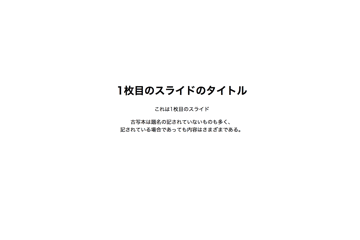
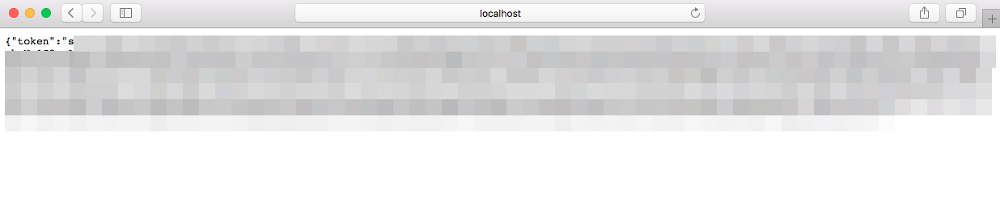
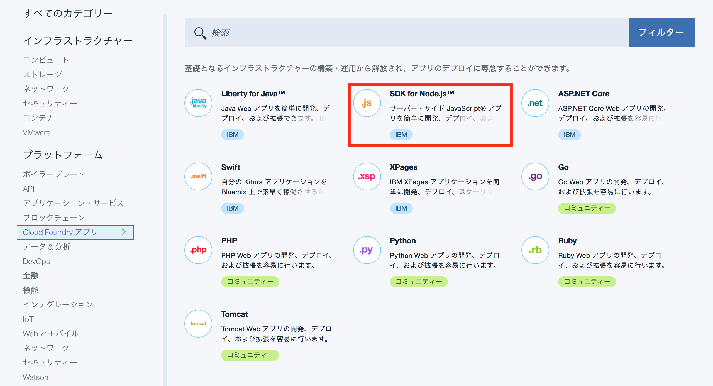
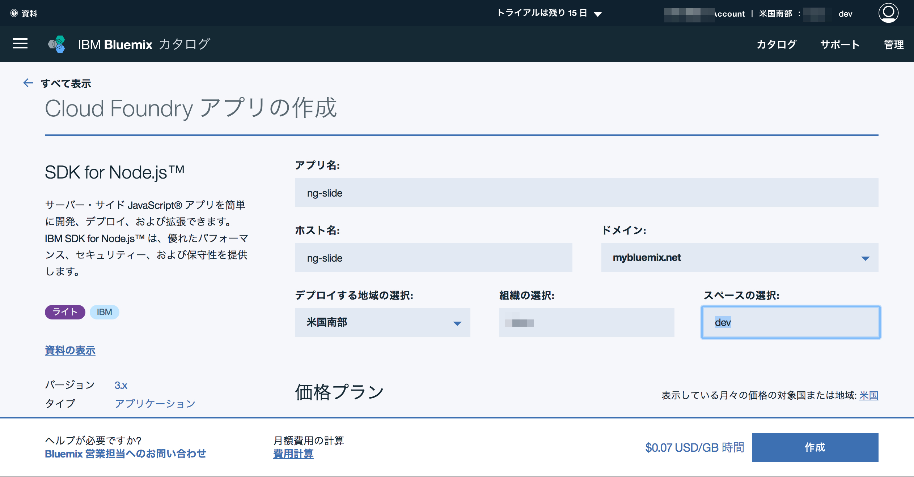
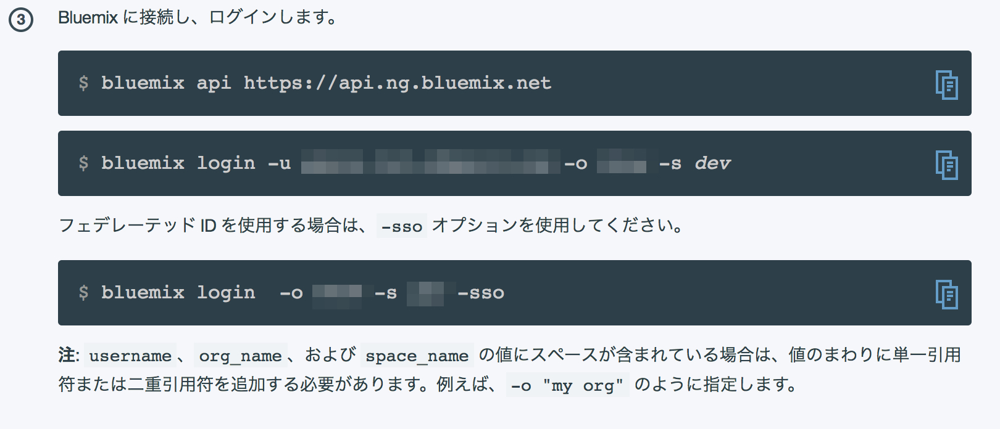
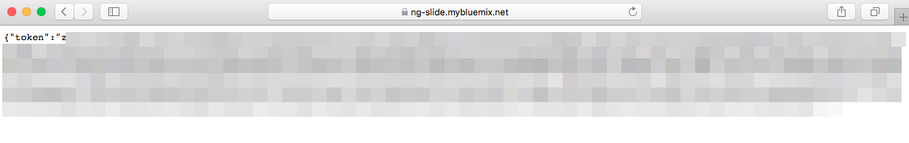
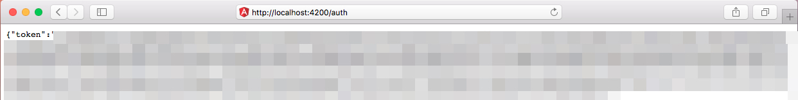
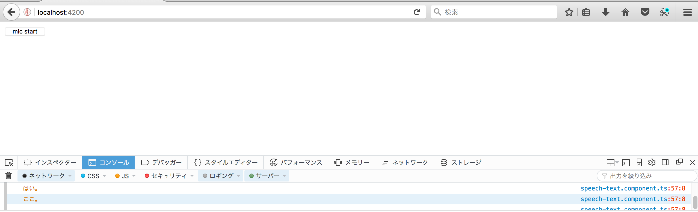
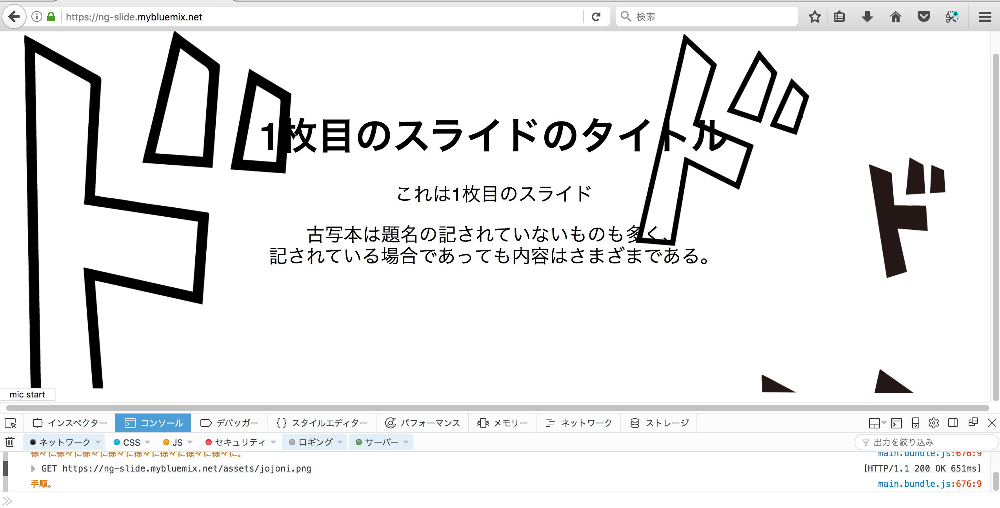
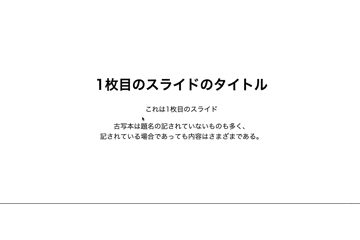

今話題の技術や最新技術への挑戦を応援する【IBM×teratailのコラボ企画】第二弾です。3回に渡って話題の技術とWatson APIをかけ合わせた開発サンプルをご紹介していきます。記事を読み進めながら、ぜひみなさんも手を動かして作ってみてください。
　第二弾は、今人気を博しているAngularを使用したオリジナルプレゼンテーションを作成するためのサンプルをご紹介いたします。

## 1. Angularでオリジナルのプレゼンスライドを作ろう
こんにちは。勉強会などで登壇しているときのスライドがありきたりで個性が埋没し,自分が八百屋の店先に山のように並んだ大根の一本であるかのような気持ちになったことはありませんか。私はUSBが一発で入らない確率と同じぐらいあります。

この記事ではいま試してみたい技術であるJavaScriptのWebアプリケーションフレームワーク[Angular]を使ったプレゼンテーションで利用するスライドを作成します。
プレゼンテーションのスライドはパワーポイントやkeynoteで作成されることが多いですが,最近はWeb上のGUIで作成されるものやHTML+JavaScriptで作成するものなど様々なものが存在します。
パワーポイントやkeynoteと違いブラウザ上で実行されるため発表用の端末に左右されず, `github.io`などのWebサーバーに公開すればどこからでもアクセスできるため重宝されています。
しかし,そういったブラウザ上で実行される多くのスライドサービスは既存のアプリケーションと違いリッチなアニメーションをつけることを不得手としています。
なので今回はプレゼンテーションをする際にほぼ必ず発生する発表者の「声」に反応しスライド上にエフェクトを表示してみようと思います。
今回利用するIBM BluemixのSpeech To Textでシンプルになりがちなスライドにエフェクトを付けてあなたも唯一無二スタイルを実現しましょう。

## 2. 利用技術の紹介
今回のアプリケーションでは以下の技術を利用します。

- Web/フロント: Angular Cli
- 認証サーバー: typescript + node.js
- 音声認識: Watson Speech to Text

IBM Watsonアカウントへの登録を事前に行ってください。また,今回のサンプルアプリケーションは以下の開発環境で作成しています。

  |環境情報|バージョン|備考|
  |--|--|--|
  |Mac OS|Sierra||
  |node|v8.3.0||
  |npm|v5.3.0||
  |angular-cli|v1.2.0|サンプルコードをcloneした場合はインストール不要|

その他使用しているライブラリの情報はpackage.jsonに記載しています。また,[angular-cli](https://github.com/angular/angular-cli)を使用しています。

### 2.1 構成

構成の実装は三段階に分かれます。第一段階ではWatson Speech To Textをユーザーが使用出来るようにするために、ExpressにAPIを用意して、WatsonのAPIトークンを発行できるようにしてWEBアプリケーションとして公開できるようにします。第二段階では、ブラウザからそのアクセストークンを使って、Watsonにアクセスして音声認識が出来るようにします。第三段階では、スライドプレゼン用のアプリケーションを作成し、実際のプレゼンで使われそうな言葉を認識させて、面白いエフェクトが出せるようにします。なお、先に完成物が気になった方は[こちら](https://github.com/motohashi/ng-slide)を御覧ください。デモは以下のようになります。




### 2.2 Watson Speech to Text
Watson Speech to Textは文法や日本語に標準対応した音声の文字書き起こしサービスです。音をそのまま書き起こすのではなく文法や辞書を加味し書き起こすため正確な書き起こしが実現できます。

詳しくはこちらの[公式ページ](https://www.ibm.com/watson/jp-ja/developercloud/speech-to-text.html)を参照して下さい。

### 3 アプリケーション用のプロジェクトを作成する

#### Angularプロジェクトを作成する

Angularのプロジェクトはangular-cliを使用することで簡単に作成することができます。
新規のプロジェクトから作成を始める場合は,所定のバージョンのangular-cliを`npm install -g @angular/cli`でグローバルインストールし,ターミナルなどのコンソールで以下のコマンドを入力します。

```shell
ng new ${project} または、 ローカルディレクトリのnode_modulesのangular-cliを使用する場合は、$(npm bin)/ng new ${project}
```

上の${project}に任意のプロジェクト名を入れるとプロジェクト名のディレクトリが作成され,配下にプロジェクトのひな型が作成されます。ng new projectで作成したプロジェクトのファイル階層は以下のようになります。（yarnを使用している場合や、バージョンの違いによって多少異なる可能性があります。）

```
project
├── .angular-cli.json
├── .editorconfig
├── .git
├── .gitignore
├── README.md
├── e2e
├── karma.conf.js
├── node_modules
├── package.json
├── protractor.conf.js
├── src
├── tsconfig.json
└── tslint.json
```

この状態で,プロジェクト配下に移動し,ng serveあるいは,npm startを実行すると,angular-cli内部で設定されているwebpack-devserverが起動し,ひな型のWEBアプリケーションが起動します。webpackの設定は通常angular-cliのnode_modulesの中に隠蔽されているため,ngコマンドを使っている限り設定を変更することができませんが,webpackの設定を柔軟に行いたい場合などにおいて

```shell
ng eject
```

コマンドを使用してangular-cliのwebpackのデフォルト設定が施されているwebpack.config.jsonとpackage.jsonを生成することもできます。プロジェクトが作成されたら、

```
npm install
```

を実行して、必要なパッケージをインストールしておきます。

### 4.2 認証用APIを作成する

### 4.2.1 認証用APIのエンドポイントを設定する

AngularプロジェクトはTypeScriptでの開発が主流であるため、ここでは、認証用APIのモジュールはTypeScriptで作ることにします。また、ExpressサーバーはES6で書くことにします。これは、tsconfig.jsonの設定をすることで、ESモジュールを読み込めるようにすることで、TypescriptとESどちらも読み込めるようになります。ここでは、Typescriptを実行できる環境としてts-nodeとtypescirptをインストールします。加えてExpressもインストールしておきましょう。body-parserはexpressのテンプレートエンジン拡張用のプラグインです。(最新版のangular-cliでは、ts-node、typescriptはpacakge.jsonに最初から入っていますのであればインストールは不要です。)

```shell
npm install --save express body-parser typescript ts-node
```

ここで、angular-cliで作成したプロジェクトのルートフォルダに、serverディレクトリを作成します。nodeスクリプト(ts-nodeも同様で)はディレクトリ配下にindex.jsを配置すること、または、package.jsonのmainオプションにファイル名を指定することで、ディレクトリ名を指定してスクリプトを読み込むことが出来ます。そこで、作成したserverディレクトリにindex.jsを配置しましょう。ここでは以下のようにindex.jsを実装します。

```javascript
const path = require('path');
const express = require('express');
const bodyParser = require('body-parser');
const app = express();
const server = require('http').createServer(app);
const port =  process.env.PORT || 3000;
const watsonAuthService = require('./watson-auth-service');

app.use(function(req, res, next) {
    res.header('Access-Control-Allow-Methods', 'GET, PUT, POST, DELETE, OPTION');
    res.header('Access-Control-Allow-Origin', '*');
    res.header('Access-Control-Allow-Headers', 'Origin, X-Requested-With, Content-Type, Accept');
    next();
});

app.use(bodyParser());

app.use(express.static(path.resolve(__dirname,'../','dist')));

server.listen(port, process.env.OPENSHIFT_NODEJS_IP || process.env.IP || undefined, function() {
  console.log('Express server listening on %d, in %s mode', port, app.get('env'));
});

app.get('/auth', function(req, res, next) {
  watsonAuthService.getAuthToken().then((token,err)=>res.json({token}));
});

```
ここで、httpモジュールはnodeの標準ライブラリになります。staticは、server/index.jsからexpress.staticはtemplateやjsに対するパスを解決して呼び出せるようにします。ここでは、Angularアプリケーションのbuild済みのファイルは全てdistディレクトリに配置されるため、distディレクトリを指定しておき、後ほどindex.htmlを読み込めるようにします。 watsonAuthServiceはエンドポイント/authにGETメソッドでリクエストが送られた際にWatsonのアクセストークンを取得できるようにするモジュールで後ほど実装します。これで最低限のserverの準備が出来ました。次に上述のwatsonAuthServiceを実装します。

### 4.2.2 認証用APIを実装する

serverディレクトリに、watson-auth-service.tsを作成し、実装します。ここで、実装に入る前にwatson-developer-cloudモジュールをインストールしておきます。

```sh
npm install --save watson-developer-cloud
```

それでは実装に入りましょう。以下のように、watson-developer-cloudに実装されているgetTokenメソッドを使用して、取得できたらトークンを渡して処理を継続し、失敗したら、error内容を渡して処理を継続するPromiseオブジェクトを作成します。それらのレスポンスは前述の/authエンドポイントにリクエストが投げられたとき、レスポンスとしてアクセストークンを返すように設定されています。以下のファイルをwatson-auth-service.tsとして保存します。

```ts
import * as watson from 'watson-developer-cloud';
import * as path from 'path';
import * as fs from 'fs';

const secret = JSON.parse(fs.readFileSync(path.join(__dirname, 'credential.json'), 'utf8'));
const authConfig = {
  version: 'v1',
  url: secret.url,
  username: secret.username,
  password: secret.password
};
const watsonAuthService = watson.authorization(authConfig);
export function getAuthToken(): Promise<string> {
  return new Promise<string>((resolve, reject) => {
    watsonAuthService.getToken({ url: authConfig.url }, (err, token: string) => {
      if (err) { reject(err); }
      resolve(token);
    });
  });
}
```

以上のファイルは、serverディレクトリの中にあるcredential.jsonというファイルからjson形式で、Watsonのアカウント情報を取得し、watson-developer-cloudモジュールにセットするようにしています。
そして、その認証情報を使用し、ユーザーにアクセストークンを取得させる処理を作成しています。よって、3.1節の画像にある、url、username、passwordを記述したcredential.jsonというファイルをserverディレクトリ配下に作成します。

```json
{
  "url": "your api url",
  "username": "your username",
  "password": "your password"
}
```

これでcredential.jsonを作成できました。次に、Bluemix上のSpeech To Textを使用するためのアクセストークンが、ローカルサーバを起動して取得できるか確かめてみます。

### 4.2.3 アクセストークンをローカルサーバを経由して取得する

node.jsの実行環境ではカレントディレクトリにあるnode_modules内のnpmパッケージの実行ファイルのパスは`npm bin`というコマンドで取得できるようになっています。そのことを利用してnpmパッケージをグローバルインストールしなくても、以下のようにカレントディレクトリ内にローカルインストールされたのnpmパッケージの実行ファイルを実行する事ができます。以下の例では、ローカルインストールされたts-nodeを利用してserverを起動します。serverディレクトリ内にindex.jsを配置しているため、呼び出されるファイルはindex.jsになります。

```
$(npm bin)/ts-node server
```

この時、Expressのデフォルトportの3000が空いていればhttp://localhost:3000/authにブラウザからアクセスすると、アクセストークンが取得できます。



無事アクセストークンを取得することが出来たら、今度は、Bluemix上にExpressサーバをデプロイしてみましょう。

### 4.3 Bluemix上のCloudFoundryにnode.jsアプリケーションをデプロイする

### 4.3.1 Bluemix CLIをインストールする
[こちらのリンク](https://console.bluemix.net/docs/cli/reference/bluemix_cli/all_versions.html#bluemix-cli-)からBlumix CLIをインストールすることが出来ます。

＊ Cloud Foundry CLIのみを使ってデプロイすることも可能です。Bluemix CLIにはCloud Foundry CLIが内蔵されているため、どちらを使用しても構いません。ここでは、Bluemix CLIのコマンドを利用して、デプロイを行います。

### 4.3.2 Cloud Foundryへのデプロイ設定を行う

node.jsアプリケーションをデプロイするのは、とても簡単です。.cfignoreファイルにデプロイに不必要なファイル、ディレクトリを記述しておくと、デプロイ時に除外されるため、必要なファイルのみをデプロイする事ができます。また、node.jsのフロントエンド側のスクリプトは全てビルド済みのファイルだけデプロイすれば良いため、ビルド前のスクリプトや本番環境で使われないファイルやnode_modulesなどはデプロイから外しておくことで、デプロイ時間を短縮できます。それらを踏まえた上で、.cfignoreの内容は以下のようになります。

```
e2e
src
node_modules
.nscode
.editorconfig
.gitignore
tslint.json
yarn.lock
karma.conf.json
*.md
asesets
typings
manifest.yml
proxy.config.json
```

Angularアプリは全てdistにビルドされるため、必要なものはts-nodeを動かすためのファイルと、Expressとそれによって配信するモジュールとdistだけになります。また、Cloud Foundryでは、デプロイ時に、Dependenciesに記述のあるパッケージのみnpm installが実行されます。よって、package.jsonからproductionに必要のないnpmパッケージは、devDependenciesに記述を移しておきましょう。このチュートリアルで使用したnpmパッケージでproductionに必要な物は最終的に以下のようになります。

```json
  "dependencies": {
    "body-parser": "^1.18.0",
    "typescript": "~2.3.3",
    "express": "^4.15.4",
    "watson-developer-cloud": "^2.39.0",
    "watson-speech": "^0.33.1",
    "ts-node": "~3.0.4"
  }
```

次にBluemixにログインしてカタログからCloud Foundryを選択します。



選択すると、以下のような設定画面が表示されるので、今回の例では以下のように設定しました。



以上のように設定を終えたら次にホストにデプロイするためにはmanifest.ymlというファイルを作成し、プロジェクトのディレクトリに配置して設定を行います。設定は以下の通りです。

```yaml
applications:
- path: .
  name: ng-slide
  memory: 512M
  instances: 1
  domain: mybluemix.net
  disk_quota: 1024M
```

pathはmanifest.ymlのパスを基準にディレクトリを指定します。nameは、applicationに設定した名前を使用します。今回必要なデプロイ設定ファイルはこれだけです。他にも様々な規模のサービスに対して柔軟な設定ができるように様々な項目が用意されています。その他のデプロイ設定項目に関して知りたい方は、[ドキュメント](https://docs.cloudfoundry.org/devguide/deploy-apps/manifest.html)をご覧ください。

最後に、Cloud Foundryにデプロイ完了後に実行されるコマンドをpacakge.jsonのscripts項目のstartに設定するか、Procfileを作成して、コマンドを設定できます。nodeアプリケーションの場合はpackages.jsonのstart項目に設定すると良いでしょう。今回は package.jsonのscriptsのstart項目を以下のように設定します。

```
NODE_ENV=production PORT=8080 ts-node server
```

### 4.3.4 Cloud Foundryにデプロイを行う

Cloud Foundryの管理画面に戻ると、デプロイ前のプロジェクトへのインストラクションがあります。はじめて、bluemixコマンドを利用する場合は、このインストラクションに従って、今まで利用したことがあり、ログイン情報の登録などが住んでいる場合は、好きな方法で設定しても構いません。



以上のコマンドにしたがってログインが完了したら、

```
bluemix app push ng-slide
```

を実行して、デプロイを実行します。ブラウザからBluemix上に存在するホストの/authに接続してアクセストークンが取得できたら、デプロイ成功です！



これでnode.jsアプリケーションを一般公開することができました。自身でWEBアプリケーションを公開する場合も、このように簡単にデプロイ出来るので筆者もこのチュートリアルを作っていて良さを感じました。

それでは、次はいよいよAngularアプリケーションを作成する手順に入ります。

## 5 Angularアプリケーションを作成する

この章ではAngularの基本的な構成を踏まえ、実際にスライドの表示と切り替え機能を持つコンポーネントを作成します。5.1節はAngularを使用したことがあるなどの理由で読む必要がないと感じた場合は、5.1節は読み飛ばしても大丈夫です。

## 5.1 Angularの基礎知識

####　5.1.1 Angularプロジェクトの基本構成

angular-cliを利用する場合,.angular-cli.jsonにbuildの設定が書き出されています。ここで,重要なのは,以下の設定です。

```json
      "index": "index.html",
      "main": "main.ts",
```

この設定は,main.tsの設定に従いテンプレートとしてのindex.htmlの中に設定されている後述のAngularのコンポーネントをコンパイルしていき,最終的にDOMレンダリングされたindex.htmlを生成する設定になります。この設定はindex.html上にAngularを含む最終的にビルドされてバンドルされたjsをscriptタグで発火させるコードが記述されています。

```ts
//main.ts
platformBrowserDynamic().bootstrapModule(AppModule);
```

AppModuleは,Angularのモジュールです。Angularのモジュールは後述するように定義されているコンポーネントやその中で使われているモジュール等をindex.htmlや他のモジュール内で使用できるように定義する,いわば設定ファイルのような役割をします。

#### 5.1.2 Angularのモジュールの構成

```ts
//app.module.ts
import { BrowserModule } from '@angular/platform-browser';
import { NgModule } from '@angular/core';
import { FormsModule } from '@angular/forms';
import { HttpModule } from '@angular/http';
import { CommonModule } from '@angular/common';
import { RouterModule, Routes } from '@angular/router';
import { AppComponent } from './app.component';
import { SlidesComponent } from './slides/slides.component';
import { SpeechTextComponent } from './speech-text/speech-text.component';
import { SlidesService } from './slides/slides.service';
import { SlideComponent  } from './slides/slide/slide.component';
import { EffectProviderBusService } from './effect-provider-bus.service'
import { BrowserAnimationsModule } from '@angular/platform-browser/animations';
import { HttpClientModule } from '@angular/common/http';

const appRoutes: Routes = [
  { path: 'slides', component: SlidesComponent },
  { path: '',      component: AppComponent },
];

@NgModule({
  declarations: [
    AppComponent,
    SlidesComponent,
    SlideComponent,
    SpeechTextComponent,
  ],
  imports: [
    CommonModule,
    BrowserModule,
    FormsModule,
    HttpModule,
    HttpClientModule,
    BrowserAnimationsModule,
    RouterModule.forRoot(
      appRoutes,
      { enableTracing: true }
    )
  ],
  exports: [ RouterModule ],
  providers: [SlidesService,SlidesService, EffectProviderBusService],
  bootstrap: [AppComponent]
})
export class AppModule { }

```

以上は本サンプルコードに使用されているapp.module.tsのソースコードになります。この例に沿って説明を行います。まず,@NgModuleはデコレータでAppModuleクラスがAngularのモジュールであることを定義するとともに,設定を渡します。@NgModuleの設定値に関しては,今回よく使われる上記の例のみを説明します。そのほかの設定値に興味がある方は公式のドキュメントをご覧ください。それぞれ指定されているコンポーネントやモジュールやサービスの詳細についてはここでは割愛します。

## declarations

  前述のmain.tsで呼ばれたhtmlファイル内において,declarationsで指定されているそれぞれのコンポーネントに指定されているセレクタの条件に当てはまるタグをコンパイルできるようにします。これはこのモジュール内で指定されているすべてのコンポーネントのテンプレートのタグにも有効になり,コンポーネントのセレクタの条件に当てはまるタグが階層的にコンポーネントに置き換わるようになります。また,Directiveや,Pipeを指定するとそれらをモジュールの中で指定されている全てのコンポーネント内で使用することができるようになります。

## imports

  外部のAngularモジュールをインポートします。このときimportsに指定したAngularモジュール内でexportsに設定されているModule,Component,Directive,Pipe,providersに指定されているServiceを,importsした側のコンポーネントで有効にします。

## exports

  外部のAngularモジュールのimportsにモジュールが指定された時に指定されたモジュールがエクスポートする機能を選択します。exportsで指定したModule,Component,Directive,Pipeをimportsした側のコンポーネント側で使用することができるようになります。

## providers

  このモジュール内および,このモジュールをimportしたコンポーネント内で*Data Injection(DI)によって使用可能になるサービスクラスを登録します。サービスはデータの送信・取得などコンポーネントへのデータの渡し方や,コンポーネントのデータと連動するイベントの処理など手続き的な処理を記述するクラスの名称です。これらのサービスは対象のモジュール内で使用可能なすべてのコンポーネントにおいてつけ外しが可能になります。

## bootstrap

  コンポーネントのエントリポイントです。最初にコンパイルを開始するコンポーネントを指定します。この指定により,このモジュールが適用されている範囲が明確になります。複数のAngularアプリケーションを一つのプロジェクトで使用したい場合かつ,お互いの実装が共存できないような場合に,他のbootstrapモジュールへの干渉を防ぐためimportsの代わりに指定が必要なものです。

*Data Injection:内部変数にクラスを持つオブジェクトにおいて,その内部変数にその場でクラスのインスタンスを生成して代入するのではなく,クラスのインスタンスを関数の引数として外部から渡してその値を内部変数に代入させることで,サブクラスやインターフェース経由で継承クラスを引数の型に指定できるようにしたり,処理の手順を確定させることによって,Data Injection先のコードを一切変えずにクラスのつけ外しによる変更を容易にする実装上のテクニック。AngularにおいてはサービスをData Injectionで指定することが規約になっています。

#### Angularのコンポーネントの構成

コンポーネントはそのコンポーネント内で指定されている独自のセレクタ条件にマッチするHTMLのタグを,内部に設定されたHTMLテンプレートに置き換えます。これをレンダリングまたは,Angularの場合はコンパイルと呼びます。さらに,そのテンプレート内の一部分をコンポーネントのデータと連動させることができ,ユーザーの操作や通信によってデータが変更された場合に画面表示やそのほかのデータへの影響を即座に反映させることができます。このように内部データ同士の変更や内部データと画面描画を連動させるように設定することをデータバインディングと呼びます。テンプレートにはこのデータバインディングと画面表示を制御するための様々な記法があります(ここでは割愛します)。また,テンプレート内で更にモジュールに定義済みのコンポーネントのセレクタ条件にマッチするタグを埋め込むことで連鎖的にコンポーネントをコンパイルすることができます。以下は単純なコンポーネントの例です。

```ts
import { Component } from '@angular/core';

export class Example {
  id: number;
  text: string;
}

@Component({
  selector: 'my-app',
  template: `
    <h1>{{example.text}}</h1>
    <div>
      <label>example data binding: </label>
      <input [(ngModel)]="example.text" placeholder="input free and change h1"/>
    </div>
  `,
  styles: [`
    h1 {
      text-color:red;
    }
  `]
})
export class AppComponent {
  example: Example = new Example();
}
```

以上の例では,`<my-app></my-app>`というタグをこのコンポーネントで定義されているテンプレートに置き換え,textboxに入力した文字をh1要素の文字列として即座に反映するコンポーネントの例になります。innerTextではマスタッシュ記法と呼ばれる{{}}で囲まれた文字列を,コンポーネント内の変数の参照に対応させることで,inputの入力には[(ngModel)]="example.text"のように[(ngModel)]の右辺をコンポーネント内の変数の参照に対応させることでデータバインディングを行うことができます。ちなみに[(ngModel)]の[]はinputプロパティの指定に使うシンタックスで内部変数が変更されるとtextboxの文字列も変更されるように単方向データバインディングします。この場合,textboxへの入力は内部変数には反映されません。そして,()はoutputプロパティの指定を表し指定されたプロパティの変更に応じて動作する処理を渡します。[(ngModel)]と指定するとプロパティの値の変更とtextboxの値を連動させ,ユーザーの入力を内部変数の変更と連動させることができます。ただし(ngModel)の指定は機能しません。これは,[ngModel]が内部変数のプロパティにsetterを付加するのに対し,(ngModel)単体の場合は未定義のsetterに対して入力値を代入するというような動作をしていると考えられます。stylesはこのコンポーネントの内部だけで有効なスタイルを指定できます。templateやstylesは外部ファイルに置き換えてパスを指定することもできます。

### 6 Watson Speech to Textのコンポーネントを作る

Service、Component、Module等を追加する際にapp.module.tsの設定は必須です。app.module.tsのうち、チュートリアルの過程で新しくAngularクラスを作成した場合は、その都度必要な設定をコピーして設定してください。

### 3.1 Watson Speech to Textを利用する準備

まずサービス用の認証情報を作成します。 [Bluemixコンソール](https://console.bluemix.net)の左上メニューよりWatsonサービスを選択します。


Watsonサービスの作成を押下後のリストよりSpeech To Textを選択します。

ここでアプリ名は`sample-stt-application`など判別できる名前をつけてください。

サービス資格情報から先ほど作成した資格情報のアクション[資格情報の表示]を選択すると以下のような画面が表示されます。


このjsonデータは後ほどcredentail.jsonというファイルに書き写します。これで準備完了です。


### 開発環境用にAngular用のサーバでExpressサーバのプロキシを行う

本番環境ではAngular SPAを配信するサーバをExpressに統合しますが、開発環境ではngコマンドを使用している限りAngular用の開発サーバとExpressサーバは別々に起動させて開発することになります。この時、ExpressにAngularコンポーネントから、Expressのサーバにリクエストを飛ばすためにエンドポイントを書き直したり環境変数を使うのは無駄なので、開発用のサーバにプロキシを設定します。ng serveはwebpack-devserverを内部にラップして動かしているので、proxy.config.json(任意の名前で大丈夫です)というファイルを以下の内容で作成して、プロジェクトのルートに配置します。

```
{
  "/auth": {
    "target": "http://localhost:3000",
    "secure": false
  }
}
```

secureはプロキシで通信する際にSSL認証を行うかどうかの指定を行います。デバッグ用のサーバなので、ここでは、falseに設定しておきます。ポートが3000番なのは、Expressのproxyのデフォルトの設定が3000で設定されているためです。ng serveのデフォルトポートは4200番です。どちらも問題があれば変更しても構いません。その後

```
ng serve --proxy-config proxy.config.json
```

を実行するとlocalhost:4200/authのアクセスから、localhost:3000/authにアクセス出来るようになります。試しに

```
$(npm bin)/ts-node server
```
を実行してサーバを起動後、localhost:4200/authにアクセスしてみましょう。以下のようにアクセストークンを取得できたら成功です。




その後、開発中にts-node serverとng serveを同時に実行するscriptsをpackage.jsonに追加しておくと開発が楽になります。今回のprojectでは以下のように設定してあります。

```json
  "scripts": {
    "ng": "ng",
    "start": "NODE_ENV=production PORT=8080 ts-node server",
    "server": "ts-node server | ng serve --proxy-config proxy.config.json && wait",
    "build": "ng build",
    "test": "ng test",
    "lint": "ng lint",
    "e2e": "ng e2e"
  },
```

以上のserverコマンド(任意のコマンド名にしても構いません)を自分で設定することによって、

```
npm run server
```
で同時にサーバを起動させ、同時にサーバを停止させることが出来るようになります。

### ブラウザからWatson Speech to Textを利用出来るようにする

watson-speechというライブラリを使うため、インストールされていなければ以下を実行します。

```
npm install --save watson-speech
```

次にWatson Speech to Textを利用するための `SpeechTextComponent`を作成します。

```
$ ng g component speech-text
```

上記を実行し、足りないファイルを作成して以下のコンポーネントの構成を作ります。

```
speech-text
├── speech-text.component.css
├── speech-text.component.html
├── speech-text.component.spec.ts
├── speech-text.component.ts
└── effect-provider-bus.service.ts
```

まずは、Watsonのアクセストークンを取得できるようにクライアントからHTTPリクエストができるようにします。これはHttpClientModuleに実装されてるメソッドを使えば実現できるので、app.module.tsでこれを有効にします。


```ts
import { HttpClientModule } from '@angular/common/http';
@NgModule({
  declarations: [
    AppComponent,
    SpeechTextComponent
  ],
  imports: [
    BrowserModule,
    HttpClientModule
  ],
  providers: [],
  bootstrap: [AppComponent]
})
```


次に、speech-text.component.tsに母体になるComponentクラスを作成します。

```
import { Component, OnInit, ChangeDetectorRef } from '@angular/core';
import * as recognizeMicrophone from 'watson-speech/speech-to-text/recognize-microphone';
import { HttpClient } from '@angular/common/http';

@Component({
  selector: 'app-speech-text',
  templateUrl: './speech-text.component.html',
  styleUrls: ['./speech-text.component.css']
})
export class SpeechTextComponent implements OnInit {

  private isRecording = false
  private recognizeStream = null

  constructor(private http: HttpClient,
     private detector: ChangeDetectorRef,
     private _effectService: EffectProviderBusService
  ) {
  }

  ngOnInit() {

  }
}
```

この節に関する処理は全て、speech-text.component.tsのインスタンスメソッドとして、実装していきます。アクセストークンを取得する関数`getTokenAsync`を用意し,ボタンがクリックされたときに音声の録音が開始され、Watsonによってそれらがテキストに変換されたデータを受けとって処理できるようにします。
この処理をhandleMicClickという関数で実装していきます。実装は以下のようになります。

```ts
//speech-text.component.ts
getTokenAsync() {
  return this.http.get('/auth');
}
```

```ts
//speech-text.component.ts
async handleMicClick() {
  if (this.recognizeStream) {
    this.stopRecognizeStream()
  } else if (!this.isRecording) {
  this.isRecording = true
  await this.getTokenAsync().subscribe(token => {
      this.startRecognizeStream(token['token']);
    })
  }
}
```
先程のproxyの設定で、http.get('/auth')はlocalhost:4200/authのリクエストは、localhost:3000/authに飛ぶようになっています。
そして、Watsonの接続の初期設定と録音を開始するstartRecognizeStream、stopRecognizeStream関数を実装します。

```ts
startRecognizeStream(token) {
  const stream = recognizeMicrophone({
    token,
    model: 'ja-JP_BroadbandModel',
    objectMode: true,
    extractResults: true
  });
  stream.on('data', data => {
    if (data.final) {
      const transcript = data.alternatives[0].transcript;
      console.log(transcript)
    }
  });
  this.recognizeStream = stream
}

stopRecognizeStream() {
  if (this.recognizeStream) {
    this.recognizeStream.stop()
    this.recognizeStream.removeAllListeners()
  }
  this.isRecording = false
  this.recognizeStream = null
}
```

表示が確認できるように一度console.log(transcript);でwatsonからデータが正しく送られてくるか確認できるようにしておきます。
recognizeMicrophoneはwatson-speechというnpmパッケージに入っている関数で、これにパラメータを渡して実行すると、watsonとの接続が開始されます。
次にテンプレートにイベント発火用のボタンを作成します。`(click)`を使用してonclickイベントを定義します。

```html
//speech-text.component.html
<button (click)="handleMicClick()">mic start</button>
```

以上で、ボタンを押すと、録音を開始して音声認識出来るようになりました。これをAngularアプリケーションのファーストビューで確認できるようにするため、app.component.htmlとapp.component.tsを以下のように書き換えます。

```html
<div class="container">
  <app-speech-text></app-speech-text>
</div>
```

これでボタンが表示されるようになるので、以下のようにブラウザのdevtoolsを開いて動作確認します。マイクをONにして、コンソール上に文字列が流れてきたら動作確認完了です。これで、アクセストークンを受け取って、Watsonに接続し、音声データをテキストに変換することができました。



今回用意したslides.data.tsはスライドのデータを直接定義したもので、DBなどからデータを直接受け取る場合は用意する必要はありません。形式上titleキーを設定していますが,今回のアプリケーションでは使用していません。
## 5 Angularでスライドを作成する


#### 5.1.3 スライドを作るための準備

スライドを作成するためにhtmlファイルを文字列型でimportが出来るように設定します。
angular-cliのデフォルトの設定ではhtmlをraw-loaderで読み込むようになっていますが
そのimport先の型が定まっていないため,importすることができません。そのため`src/typings.d.ts` に下記のようにhtml拡張子のファイルが読まれた時にどう処理するかの指定を追加します。

```ts
declare module "*.html" {
  const content: string;
  export default content;
}
```
#### 5.1.4 スライドを作るための構成

以下のようなファイル構成でスライド設置用のコンポーネントを作成していきます。

```
src/app/slides
├── slide
│   ├── slide.component.html
│   ├── slide.component.ts
│   └── template
│       ├── 1.html
│       ├── 2.html
│       └── 3.html
├── slides.component.css
├── slides.component.html
├── slides.component.ts
├── slides.data.ts
└── slides.service.ts

```

angular-cli を使用することで,
`ng g component slides`を実行した後`ng g component slides/slide`と実行し,直接作成する手間を省きます。作成されないファイルについては手動で作成します。

#### 5.1.5 各ファイルの実装

slides.component.tsはスライド全体を管理するコンポーネントです。@HostListenerによってこのコンポーネントにおけるイベントをフックすることができます。ここでは,LeftキーとRightキーにイベントをフックできるようにしています。

```ts
//slides.component.ts
import {
  HostListener,
  Component,
  Input,
  Output,
  EventEmitter,
  OnInit
} from '@angular/core';
import {trigger, animate, style, transition, animateChild, group, query, stagger} from '@angular/animations';
import {SlidesService} from './slides.service';
import {SlideComponent} from './slide/slide.component';

@Component({
  selector: 'app-slides',
  templateUrl: './slides.component.html',
  styleUrls: ['./slides.component.css'],
})

export class SlidesComponent implements OnInit {

  @Input() public slides;
  currentIndex = 0;
  selectedSlide = null;

  constructor(
              private _slideService: SlidesService,
            ) {
    this.slides = this._slideService.getAll();
  }

  ngOnInit() {
    this.selectSlide(this.currentIndex);
  }

  selectSlide(slide_id: any) {
    if ( slide_id !== this.selectedSlide) {
      this.selectedSlide = slide_id ;
    }else {
      this.selectedSlide = null;
    }
  }

  @HostListener('window:keyup.arrowRight')
  onArrowRight() {
    if (this.currentIndex + 1 < this.slides.length) {
      this.selectSlide(++this.currentIndex);
    }
  }

  @HostListener('window:keyup.arrowLeft')
  onArrowLeft() {
    if (this.currentIndex - 1 >= 0) {
      this.selectSlide(--this.currentIndex);
    }
  }
}
```

SlidesComponentのcurrentIndexというパラメータで現在何ページ目のスライドなのかを管理します。
次に、SlidesComponentのテンプレートをみてみましょう。

```html
//slides.component.html
<ng-container *ngFor="let slide of slides;let i = index;">
  <app-slide [html]="slide.page" *ngIf="currentIndex==i" (close)="selectSlide(null)" ></app-slide>
</ng-container>
```

ここで子コンポーネントのapp-slideに対して[html]要素にhtml文字列をパラメータとして与えると、そのHTMLを表示することができるようにSlideComponentを設計しています。slide.pageはslides変数の配列中に入っているslideオブジェクトのパラメータで、固有のHTMLがセットされています。ngIfを使って、currentIndexの値が変化した時に表示するhtmlを切り替え、プレゼンテーション用のスライドのような仕組みを作っています。次にslides.service.tsを実装します。

```ts
//slides.service.ts
import {Injectable} from '@angular/core';
import {SLIDES} from './slides.data';

@Injectable()
export class SlidesService {
  private _slides = [].concat(SLIDES);
  getAll() {
    return this._slides;
  }
}
```

SlideServiceによって、以下slide.data.tsに設定したHTMLを取得することが出来るようにします。

```ts
//slides.data.ts
import page1 from './slide/template/1.html';
import page2 from './slide/template/2.html';
import page3 from './slide/template/3.html';

export const SLIDES = [
  {
    title: 'start',
    page: page1
  },
  {
    title: 'middle',
    page: page2
  },
  {
    title: 'end',
    page: page3
  }
]
```

ここで、slide/template/1.html、2.html、3.htmlは任意のHTMLを設定できるので、好きなように設定します。今回

```
<header>
  <h1>1枚目のスライドのタイトル</h1>
</header>
<p>これは1枚目のスライド</p>
<p>古写本は題名の記されていないものも多く、<br>記されている場合であっても内容はさまざまである。</p>

```


```
<header>
  <h1>２枚目のスライド</h1>
</header>
<p>源氏物語のスライド</p>
<ul>
  <li>正編前紀: 桐壺から朝顔</li>
  <li>正編中紀: 少女から藤裏</li>
  <li>正編後紀: 若菜から竹河</li>
</ul>

```

```
<header>
  <h1>3枚目のスライド</h1>
</header>
<p>これは3枚目のスライド</p>
<table border="1px" align=center>
  <tr>
    <td>動物</td><td>魚</td>
  </tr>
  <tr>
    <td>犬</td><td>チヌ</td>
  </tr>
  <tr>
    <td>うさぎ</td><td>うなぎ</td>
  </tr>
</table>
```
という感じでかなり自由なファイルを３つ作りました。


次に、slide.component.tsにスライドの実態となるSlideComponentを作成します。htmlというパラメータを設定することで,任意のDOMをAngularコンポーネントに渡せるようにしています。Angular Animationsに関しては詳細を割愛します。詳しくは,[公式のドキュメント](https://angular.io/guide/animations)を参照してください。

```ts
//slide.component.ts
import {HostBinding, Component, Input, Output, EventEmitter} from '@angular/core';
import {trigger, animate, style, transition, animateChild, query} from '@angular/animations';

@Component({
  selector: 'app-slide',
  templateUrl: './slide.component.html',
  styleUrls: ['./slide.component.css'],
  animations: [
    trigger('nextAnimation', [
      transition(':enter', [
        query('*', [
          style({ transform: 'translateX(200px)', opacity: 0 }),
            animate('1200ms cubic-bezier(0.35, 0, 0.25, 1)', style('*'))
        ])
      ])
    ])
  ]
})

export class SlideComponent {
  @Input() html;
  @HostBinding('@nextAnimation') next = false;
}

```

```html
<div [innerHTML]="html" class="page"></div>
```

以上でスライド関連のコンポーネントの実装は終わりになります。その後app.module.tsなどのmodule管理に,

```ts
//app.module.ts

import { SlidesComponent } from './slides/slides.component';
import { SlidesService } from './slides/slides.service';
import { SlideComponent  } from './slides/slide/slide.component';
import {BrowserAnimationsModule} from '@angular/platform-browser/animations';

//<中略>

@NgModule({
  declarations: [
    ...<中略>
    SlidesComponent,
    SlideComponent,
  ],
  imports: [
     ...<中略>
    BrowserAnimationsModule,
  ],
  providers: [SlidesService, SlidesService],
})
```

の設定を追記し,Routesや

```
<app-slides></app-slides>
```

で使用することが出来るようになります。app.component.htmlと関連するcssを以下のように設定しましょう。

```
<div class="container">
  <app-speech-text></app-speech-text>
  <app-slides></app-slides>
</div>
```

```css
//app.component.css
  .container {
    position: absolute;
    width: 100%;
    height: 100%;
  }
```

```css
//slides.component.css
  :host {
    position:relative;
    height:inherit;
    overflow:hidden;
    display:block;
    height: 100%;
    width: 100%;
  }

  div.page {
    text-align: center;
    font-size: 24px;
  }
  div.page p  {
    text-align: left;
  }

```


```css
//slide.component.css
:host {
  position:relative;
  height:inherit;
  overflow:hidden;
  display:block;
  height: 100%;
  width: 100%;
  top: 20%;
}

div.page {
  text-align: center;
  font-size: 24px;
}
div.page p  {
  text-align: left;
}


```

これでスライドの動作が確認できるようになります。


ブラウザで確認できたら、エフェクトをつける作業に入ります。

### 4.3 受け取ったデータを元にエフェクトをつける

Watson Speech to Textから返ってきた文字列を元にスライドにエフェクトを付けていきます。ある特定の文字列がWatsonからのレスポンスに含まれていたら、app.component.htmlの背景にCSSやCanvasでアニメーションを設定します。SpeechTextComponentはAppComponentの子コンポーネントなので、Watsonからレスポンスを受け取ったというイベントトリガーを作成して、親コンポーネントの処理が行われるようにします。このような場合、サービス内でイベントバスを作成してDIされたクラス間のイベントを相互に管理すると実装がシンプルになります。よって以下のように、effect-provider-bus.service.tsを作成します。

```ts
import {Injectable, EventEmitter} from '@angular/core';

@Injectable()
export class EffectProviderBusService {
  public effectEvent$: EventEmitter<any>;

  constructor() {
    this.effectEvent$ = new EventEmitter();
  }
}
```

これを使用できるように、app.module.tsにも設定を加えます。


```ts
import {EffectProviderBusService} from './effect-provider-bus.service';

providers: [
    //・・・
    EffectProviderBusService
]
```

speech-text.component.tsのwatsonからのレスポンスを受け取った時に、effectEvent$をemitすることで、このイベント処理をsubsclibeで設定しているコンポーネントのコールバックが実行されます。まずは、speech-text.component.tsにレスポンスチェックとイベントをemitするコードを追加します。

```ts
import { EffectProviderBusService } from '../effect-provider-bus.service'

constructor(private http: HttpClient,
     private detector: ChangeDetectorRef,
     private _effectService: EffectProviderBusService
) {}

private keywords = {
  '徐々に' : 'jojoni',
};

startRecognizeStream(token) {
  const stream = recognizeMicrophone({
    token,
    model: 'ja-JP_BroadbandModel',
    objectMode: true,
    extractResults: true,
    keywords: Object.keys(this.keywords),
    keywords_threshold: 0.7,
  });
  stream.on('data', data => {
    if (data.final) {
      const transcript = data.alternatives[0].transcript;
      this.checkEffectedWord(transcript);
    }
  });
  this.recognizeStream = stream
}

checkEffectedWord(word) {
  for (const _keyword in this.keywords ) {
    if (word.match(_keyword)) {
      this._effectService.effectEvent$.emit(this.keywords[_keyword]);
    }
  }
}
```

constructorにはEffectProviderBusServiceのDIを追加することで、どのコンポーネントでも共通のeffectEvent$にアクセスできるようになります。次にapp.component.tsでsubscribeの設定をします。

```ts
import { Component, OnInit } from '@angular/core';
import {EffectProviderBusService} from './effect-provider-bus.service';
import 'rxjs/add/operator/concatMap'
import { ChangeDetectorRef } from '@angular/core'

export class AppComponent implements OnInit {
//...//
bgEffect;
constructor(
  private _effectService: EffectProviderBusService,
  private ref: ChangeDetectorRef
) {
  this.bgEffect = '';
}

ngOnInit(): void {
  this._effectService.effectEvent$.concatMap((className) => {
    return this.animate( className );
  }).subscribe( ( className ) => {
    this.bgEffect = '';
    this.ref.detectChanges();
  });
}

animate( className ) {
  this.bgEffect = className;
  this.ref.detectChanges();
  return new Promise((resolve, reject) => {
    setTimeout(resolve, 5000);
  });
}
```

bgEffectの値をclass値にbindingすることで、bgEffectの値によって、異なるEffectが出るようにします。ここでは、jojoniという値になっていた場合、背景に透過画像を設定します。ここでは５秒間エフェクトが持続するようにしています。bgEffectをバインディングしたテンプレートは以下のようになります。


```html
<div id="bg" [ngClass]="bgEffect">
</div>
<div id="slide" class="container">
  <app-slides></app-slides>
  <app-speech-text></app-speech-text>
</div>
```

bgEffectの値がjojoniの値になった時に設定するCSSは以下のように設定します。

```css
  .container {
    position: absolute;
    width: 100%;
    height: 100%;
  }

  .jojoni {
    width: 100%;
    height: 100%;
    background: url("/assets/jojoni.png");
    position: absolute;
    background-size: 100% auto;
    opacity: 1;
    animation: jojolike .1s infinite;
  }


  @keyframes jojolike {
    0% {transform: translate(0px, 0px) rotateZ(0deg)}
    25% {transform: translate(4px, 4px) rotateZ(1deg)}
    50% {transform: translate(0px, 4px) rotateZ(0deg)}
    75% {transform: translate(4px, 0px) rotateZ(-1deg)}
    100% {transform: translate(0px, 0px) rotateZ(0deg)}
  }
```

更にGithubにあるjojoni.pngをapp/src/assets/jojoni.pngに配置しておきます。これで、bgEffectの値によって、背景のエフェクトが変わる処理が実装できました。
実際にボタンを押して、徐々にという言葉を録音してみましょう。上手くいくと以下のようにアニメーションが走ります。


#### 出来たアプリケーションをデプロイ出来るようにする

Angularアプリケーション実行に必要なファイルは全て、distに吐き出されるように設定しているので、これをExpressでアクセスできるようにします。server/index.js

```javascript
app.use(express.static(path.resolve(__dirname,'../','dist')));
app.get('/', function(req, res, next) {
  res.render('index');
});
```
を足します。これによって、/でindex.htmlにアクセスできるようになります。deployする場合は、ng buildを実行してからデプロイを行います。うまくデプロイができてれば、Blumixのホストからコンテンツが見られるようになります。



以上で、このチュートリアルは終了になります。

#### おまけ

発表の最後には「ありがとうございました。」と締めることが多いですよね。ということで、ソースコードには、Canvasで、「ありがとう」という言葉が認識されると、花火が打ち上がるコードを収録しています。



このようにtemplateにcanvas要素を差し込むことで、Canvasを利用したリッチなアニメーションをつけることも出来ます。実装が気になる方は、ソースコードを見てみてください。


## 6 終わりに

社内社外や学内学外問わず勉強会での登壇やLTなどスライドを用い発表することは様々な機会であるとおもいます。無償有償問わずクールなスライドが世の中に出てきていますが,音声に反応するスライドを作り他の登壇者に差をつけましょう！

またWatsonの他のAPIを利用することでエフェクトを付けるだけでなくリアルタイムで字幕をつけたり,
Language Translatorを利用して和英/英和の翻訳を施した字幕をつけたりと,よりプレゼンとしての機能を拡張することが出来ます。ぜひお試しください。
